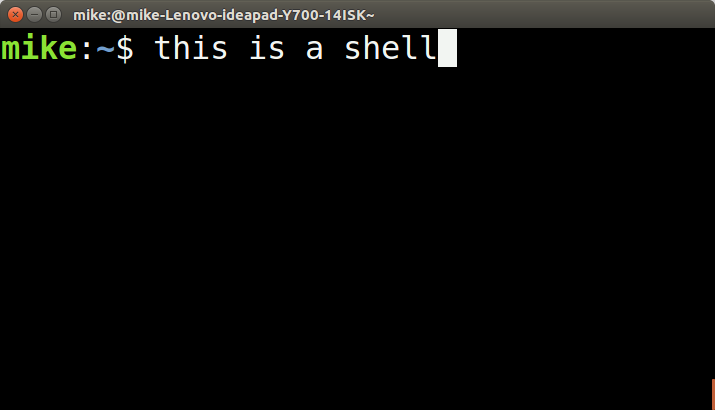

# README Please :)

# Introduction

This is my very own own shell-- the mini-shell!

[Shell's](https://en.wikipedia.org/wiki/Shell_(computing)) (or sometimes called command-line interfaces) are text based applications that serve as an intermediate between the user and the operating system. The shell is also a tool for how a user interacts with the operating system. 

